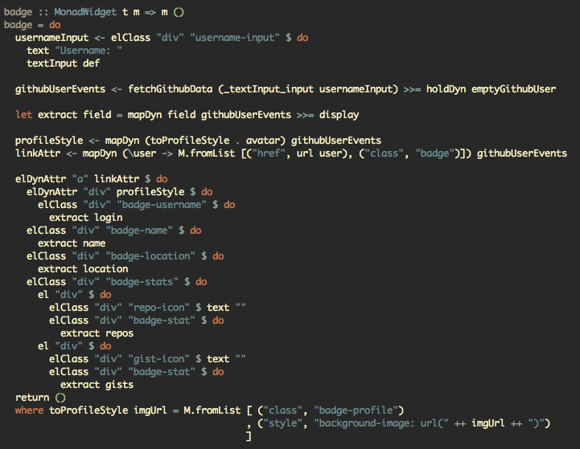
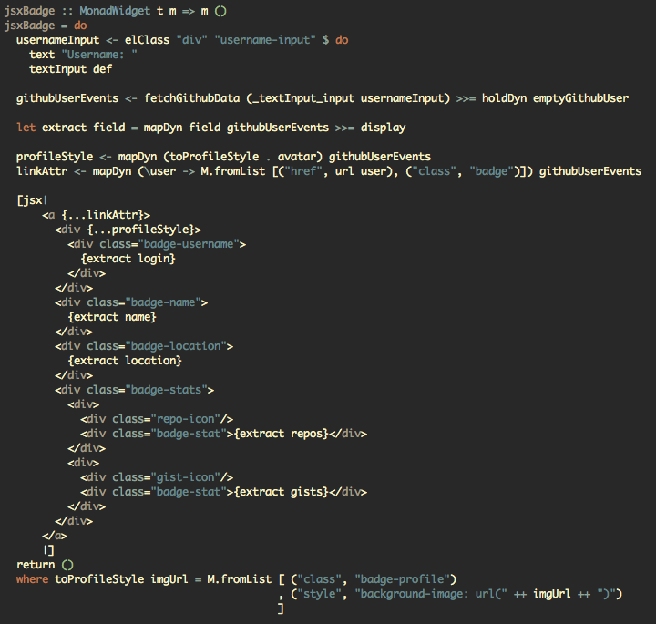

# Reflex JSX

[](https://travis-ci.org/dackerman/reflex-jsx)

`reflex-jsx` is a parser and quasiquoter that lets you write
html-like syntax inside of a reflex `MonadWidget t m` instance.

What's reflex, you ask?  In short, it's a
[Functional Reactive Programming](https://en.wikipedia.org/wiki/Functional_reactive_programming)
library in Haskell that compiles to JavaScript for use on
websites. You'd use it anywhere you might otherwise use
[React](https://facebook.github.io/react/) or
[Angular](https://angular.io/).

Here's a quick motivating example. The following code shows a Github
badge based on the username you enter, updated as you type.


In regular Reflex, here's what the code looks like (leaving out data
types and the XHR)



Here's what that same widget looks like with `reflex-jsx`:



## Usage

1. Get a build working with Reflex. Due to GHCJS, this isn't as
    trivial as normal libraries. I recommend going through Ryan
    Trinkle's
    [reflex instructions](https://github.com/reflex-frp/reflex-platform#reflex-platform)
    first, and getting a basic app up and running (using the
    `try-reflex` command).
2. From there, you can depend on the `reflex-jsx` library inside of
  `build-depends` of your cabal file as usual, and use the `work-on`
  command from the above platform. It looks something like this:

    ```bash
    /path/to/reflex-platform/work-on ghcjs ./your-project
    cd your-project/src
    ghcjs Main.hs
    ```

  This would work if your code lives in `src` and your main file is
  `Main.hs`. Make sure you invoke `work-on` from the parent directory.

3. At the top of the file, enable quasi-quoting, and import the lib:

   ```haskell
   {-# LANGUAGE QuasiQuotes #-}

   import ReflexJsx
   ```
4. Use the code in a function, like so:

   ```haskell
   mainLayout :: MonadWidget t m => String -> m () ->  m ()
   mainLayout title content = do
     [jsx| <div>
             <div class="header">{text title}</div>
             <div class="body">{content}</div>
           </div>
         |]
    ```

## Examples

### Basic HTML with attributes

Something like:

```html
[jsx| <div class="red" style="color:blue"></div> |]
```

is converted into

```haskell
el "div" (Map.fromList [("class", "red"), ("style", "color:blue")]) $ text ""
```

So there's no restriction on the element type, and the attributes are
`(String, String)` as it is in Reflex itself.

### Splicing in an expression as a node

`Splicing` or `Antiquoting` is where you can embed a haskell expression inside
of the quasiquoted value. You can embed an expression anywhere you'd normally
put a DOM node, and you escape it with `{}`. The constraint is that any
expression you pass in needs to evaluate to `MonadWidget t m => m a` - which is
the normal type for any elements, static or dynamic.

For example, you could embed a simple `text "value"` that is unchanging, or a
`textInput` element that changes over time. The only thing to remember is that
you can't currently get values out of the nodes you insert, so for more
complicated data flows, you might not be able to use a `jsx` block at all. In
that case, it is probably easier to use functions anyway.

Here's a more meaty example from a food tracking app:

```haskell
consumedFoodView :: MonadWidget t m => ConsumedFood -> m ()
consumedFoodView (ConsumedFood id name nutrition amount) =
  do [jsx| <div class="consumed-food">
          <div class="line">
            <div class="stats">
              <span class="food-name">{text name}</span>
              <div class="calories">
                {nutritionData (calories nutrition) "cals"}
              </div>
            </div>
            {macrosPie nutrition 50}
          </div>
          <div class="line">
            <div class="macros">
              {nutritionData (proteinGrams nutrition) "protein (g)"}
              {nutritionData (fatGrams nutrition) "fat (g)"}
              {nutritionData (carbGrams nutrition) "carbs (g)"}
            </div>
          </div>
        </div> |]
```

Or, take a look at the syntax-highlighted version in Emacs if you tweak your
`haskell-mode` slightly. 

Notice we have a component that takes in a `ConsumedFood` with some values, and
splices them into the jsx body. First we have `{text name}`, which is using the
reflex function `text :: MonadWidget t m => String -> m ()` to take a constant
string and display it inside the `span`.

Next, you can see some more complicated splicing. `nutritionData` is itself a
custom component created in this file, and is a `MonadWidget t m` as well. You
can put any haskell expression inside the curly braces, as long as it evaluates
to a reflex widget. The other examples here are just more of the same type of
calls.

### Splicing in a `String` attribute

The example above lets you splice in your own nodes, but you can also splice in
an attribute value. For instance, you can do something like this:

```haskell
[jsx| <div style={"color: " ++ myColor ++ ";width:10px;height:10px"}/> |]
```

### Splicing in a dynamic set of attributes

If you replace all of the attributes, you can pass in a set of dynamic ones. To
do this, you pass in an expression that evaluates to a type
[`Dynamic t (Map String String)`](https://hackage.haskell.org/package/reflex-0.4.0/docs/Reflex-Dynamic.html#t:Dynamic).
This means you are passing in a `Map` that changes over time, and the attributes
will update and re-render automatically as necessary.

Here's an example of modifying a color based on a text box:

```haskell
colorSelector :: MonadWidget t m => m ()
colorSelector = do
  input <- textInput def
  selectorAttrs <- mapDyn (\color -> Map.singleton "style" $ "color:" ++ color) (_textInput_value input)
  [jsx| <div {...selectorAttrs}>test selector</div> |]
```

The value `(_textInput_value input)` returns a `Dynamic t String` of changing
input box values, and then the mapping line creates a dynamic map value with the
color equalling the current textbox value. This gets spliced in as the
attributes to the `div` in the jsx body, and causes the text to dynamically
change color.

## FAQs

### Failed to load interface for `Gtk2HsSetup`

This is due to the following issue:
https://github.com/gtk2hs/gtk2hs/issues/179 .

The fix is to run `stack install gtk2hs-buildtools`.

### Is this the same JSX as React's version?

The name comes from React's JSX, but it's not trying to be feature-for-feature
mapping of functionality. It's simply meant to play a similar role to JSX in
that it allows the programmer to write HTML-like syntax where it feels
appropriate (i.e. HTML-heavy components that don't have as much interactivity).

I almost called it `hsx` until I discovered that there was already an
established package with that name on Hackage.

I imagine Reflex users will want to use this syntax less often than React users
use JSX, as Reflex's interspersed return values make some types of components
easier to represent with regular functions. I don't recommend this be used all
over the place, because the template haskell slows down compile times, and it
adds a layer of indirection.

### I got a ridiculous looking error

Sorry about that - I actually am not sure how to make the errors nicer. I
essentially just splice in whatever you provide as Template Haskell expressions
using `haskell-src-meta` and let the compiler figure it out if it's not
well-formed. However, sometimes the compiler gets really confused and fails in a
weird way. If anyone knows how to do reliable reflection on TH Exp datatypes to
determine what they are (i.e. `String` vs. `MonadWidget t m`), then I could fail
earlier with a nicer message.

### How stable is this?

Consider it extremely experimental. It's not feature complete, and has only been
used by me a little bit on a side-project, so far from battle tested. Also, this
is my first time working with Quasiquotes and Template Haskell so the
implementation might broken. Do let me know if you run into issues though, and I
will fix them as quickly as possible!

### I have a suggestion for improvement, or want to make a PR

I'm happy to get suggestions on any aspect of the library! I may be doing things unidiomatically
and appreciate getting style, implementation, and any other feedback you want to provide. Even
better if you want to submit a PR to improve the library.

## TODOs (eventually)

* Support both dynamic and static attr maps (currently only dynamic is
  supported)
* Tests to make sure the parsing catches the edge cases, and handles things okay
  when on failure.
* Better error messages if possible when it parses fine, but the types don't
  match up properly.
